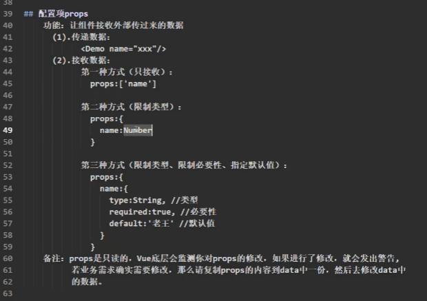

# 笔记
- 什么是render配置项？  

- 在vue中操作dom,要用ref
  - 如果给组件打上ref ，拿到的就是Vc
  - 
# ref属性
1.被用来给元素或了组件注册引用信息(id的替代者)
2.应用在htm1标签上获取的是真实D0州元素，应用在组件标签上是组件实例对象(vc)
3.使用方式：
打标识：<h1ref="xx">....</h1>或<5 chool ref:="xxx"></School>
获取：this.Srefs,xxx

## 配置项props
功能：让组件按收外部传过米的数据

# 混合

